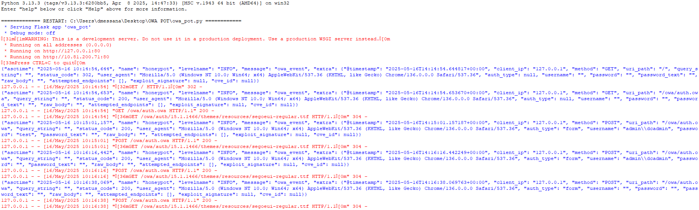
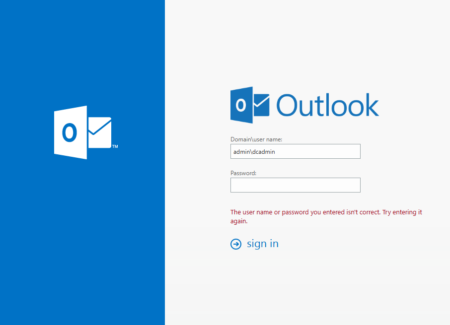

# owa-honeypot

A Flask-based Outlook Web Access (OWA) honeypot, T-Pot friendly, with ELK integration and enriched JSON logging.

---


## What’s New in v1.1.0

* **ELK Stack Integration**
  Send structured JSON logs directly to Elasticsearch via env vars: `REMOTE_ELK_ENABLE`, `ELK_URL`, `ELK_USER`, `ELK_PASS`, `ELK_INDEX`, `ELK_USE_SSL`.
* **Rich JSON Logging**
  Powered by `pythonjsonlogger`, capturing `@timestamp`, `client_ip`, `method`, `uri_path`, `user_agent`, and more.
  Logs to stdout (for Filebeat/T-Pot) **and** a local `dumpass.log` file.
* **Modular Flask App**
  Factory pattern (`create_app()`) for easy testing & extension.
  Central `log_event()` helper unifies form- and Basic-auth captures.
  Stubbed `detect_exploit()` ready for custom signature/threshold detection.
* **Realistic IIS/ASP.NET Headers**
  Responses include `Server: Microsoft-IIS/7.5` and `X-Powered-By: ASP.NET` to fool scanners.
* **Comprehensive Endpoint Coverage**
  Over 20 common OWA/Exchange routes (EWS, Autodiscover, OAB, PowerShell, etc.) all funnel into the fake login.
* **Custom Error Pages**
  Handlers for 401, 403, and 404 that log then serve your own templates (`401.html`, `403.html`, `404.html`).
* **Secure Defaults & Cleanup**
  Overwrites `dumpass.log` on startup to avoid leaking old credentials.
  Uses Flask’s `instance_path` for config isolation.
* **Copy-Paste Friendly Setup**
  Single Python script—no external templates beyond static assets.
  Fully driven by environment variables (no hard-coded credentials).

---

## Features

* Structured JSON logging via `pythonjsonlogger`
* ELK/Elastic integration for real-time monitoring
* Flask factory architecture for modularity
* IIS/ASP.NET emulation (headers & error pages)
* Faux login page capturing credentials
* Stub for custom exploit/threshold detection
* Config isolation & secure defaults

---

## Prerequisites

* Python 3.7+
* Flask
* `pythonjsonlogger`

---

## Installation

```bash
git clone https://github.com/tekmyster/owa-honeypot.git /opt/owa-honeypot
cd /opt/owa-honeypot
python3 -m venv env
source env/bin/activate
pip install -r requirements.txt
```

Copy your `.env` file into `/opt/owa-honeypot/.env` (see **Configuration**).

---

## Configuration

Create a `.env` at the project root:

```dotenv
# Flask settings
FLASK_APP=owa_pot.py
FLASK_ENV=production
PORT=80

# Local dumpass log
DUMPASS_LOG=./dumpass.log

# ELK integration
REMOTE_ELK_ENABLE=true
ELK_URL=https://elk.example.com:9200
ELK_USER=elastic
ELK_PASS=changeme
ELK_INDEX=owa-honeypot-logs
ELK_USE_SSL=true
```

---

## Usage

### Live Output



### Login Page Behavior

1. **Blank login page**
   
2. **Username entered** (no password)
   
3. **Password missing** (with username)
   
4. **Username missing** (password only)
   

Run the app:

```bash
# From your virtual environment
python owa_pot.py
```

> **Tip:** Run behind a TLS-terminating proxy (e.g. Nginx) on port 443.

---

## Debian/Ubuntu Service Setup

Run owa-honeypot as a systemd service, with nightly restart at 3 AM.

### 1. Install Prerequisites

```bash
sudo apt update
sudo apt install -y python3 python3-venv python3-pip git

git clone https://github.com/tekmyster/owa-honeypot.git /opt/owa-honeypot
cd /opt/owa-honeypot
python3 -m venv env
source env/bin/activate
pip install -r requirements.txt
deactivate
```

Copy your `.env` to `/opt/owa-honeypot/.env`.

### 2. Create systemd Service

`/etc/systemd/system/owa-honeypot.service`:

```ini
[Unit]
Description=OWA Honeypot Service
After=network.target

[Service]
Type=simple
User=www-data
Group=www-data
WorkingDirectory=/opt/owa-honeypot
EnvironmentFile=/opt/owa-honeypot/.env
ExecStart=/opt/owa-honeypot/env/bin/python /opt/owa-honeypot/owa_pot.py
Restart=on-failure
RestartSec=5s

[Install]
WantedBy=multi-user.target
```

### 3. Nightly Restart Timer

`/etc/systemd/system/owa-honeypot-restart.timer`:

```ini
[Unit]
Description=Nightly restart of OWA Honeypot

[Timer]
OnCalendar=*-*-* 03:00:00
Persistent=true

[Install]
WantedBy=timers.target
```

`/etc/systemd/system/owa-honeypot-restart.service`:

```ini
[Unit]
Description=Restart OWA Honeypot Service

[Service]
Type=oneshot
ExecStart=/bin/systemctl restart owa-honeypot.service
```

### 4. Enable & Start

```bash
sudo systemctl daemon-reload
sudo systemctl enable --now owa-honeypot.service
sudo systemctl enable --now owa-honeypot-restart.timer
sudo systemctl status owa-honeypot.service
sudo systemctl list-timers owa-honeypot-restart.timer
```

---

## Security & Best Practices

1. **Rate-Limit Auth** – use Flask-Limiter to thwart brute-force.
2. **Enforce TLS** – terminate HTTPS at a proxy.
3. **Protect & Rotate Secrets** – vault/store ELK creds securely.
4. **Threshold Alerts** – extend `detect_exploit()` for anomalies.
5. **Log Retention** – use `logrotate` on `dumpass.log`.

---

## Upgrading from v1.0.x

1. Backup `dumpass.log`.
2. Pull latest & reinstall:

   ```bash
   git pull origin master
   pip install -r requirements.txt
   ```
3. Restart the service.

---

## License

Apache 2.0 © 2025 TekMyster
