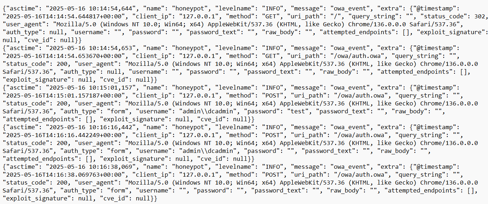

# owa-honeypot

A Flask-based Outlook Web Access (OWA) honeypot, T-Pot friendly, with ELK integration and structured JSON logging.

---


## What’s New in v1.1.0

* **ELK Stack Integration**
  Stream structured JSON logs to Elasticsearch via env vars: `REMOTE_ELK_ENABLE`, `ELK_URL`, `ELK_USER`, `ELK_PASS`, `ELK_INDEX`, `ELK_USE_SSL`.
* **Structured JSON Logging**
  Powered by `pythonjsonlogger`, capturing `@timestamp`, `client_ip`, `method`, `uri_path`, `user_agent`, and more.
  Logs to stdout and a local `dumpass.log` file for offline review.
* **Modular Flask Architecture**
  Factory pattern (`create_app()`) for extensibility and testing.
  Central `log_event()` helper abstracts form- and Basic-auth logging.
  Stubbed `detect_exploit()` for future signature- or threshold-based detection.
* **Realistic IIS/ASP.NET Emulation**
  Responses include `Server: Microsoft-IIS/7.5` and `X-Powered-By: ASP.NET` headers.
  Custom 401, 403, and 404 pages log and serve your own templates.
* **Comprehensive OWA Endpoint Coverage**
  Over 20 common Exchange/OWA routes (EWS, Autodiscover, OAB, PowerShell, etc.).
* **Secure Defaults & Cleanup**
  Overwrites `dumpass.log` on startup and isolates config in Flask’s `instance_path`.

---

## Features

* Stream to ELK/Elastic for real-time analysis
* Detailed JSON event logging
* Flexible Flask factory pattern
* Emulated Exchange headers & errors
* Single-file Python script, env-driven
* Stub for custom exploit detection
* Secure-by-default logging and config isolation

---

## Prerequisites

* Python 3.7+
* Flask
* `pythonjsonlogger`

---

## Installation

```bash
git clone https://github.com/tekmyster/owa-honeypot.git /opt/owa-honeypot
cd /opt/owa-honeypot
python3 -m venv env
source env/bin/activate
pip install -r requirements.txt
```

Copy your `.env` file into `/opt/owa-honeypot/.env` (see **Configuration**).

---

## Configuration

Create a `.env` in the project root:

```dotenv
# Flask settings
FLASK_APP=owa_pot.py
FLASK_ENV=production
PORT=80

# Local log file
DUMPASS_LOG=./dumpass.log

# ELK integration
REMOTE_ELK_ENABLE=true
ELK_URL=https://elk.example.com:9200
ELK_USER=elastic
ELK_PASS=changeme
ELK_INDEX=owa-honeypot-logs
ELK_USE_SSL=true
```

---

## Usage & Screenshots

### Screenshot Legend

| # | Description              | Image                                             |
| - | ------------------------ | ------------------------------------------------- |
| 0 | Console output           |         |
| 1 | First load / Base screen |            |
| 2 | Incorrect user/password  |  |
| 3 | No password entered      |            |
| 4 | No username entered      |            |
| 5 | JSON log output          |             |

#### Run the App

```bash
# Activate venv, then:
python owa_pot.py
```

> **Tip:** Place this behind a TLS-terminating proxy (e.g. Nginx, Traefik) on port 443.

---

## Debian/Ubuntu Service Setup

Run owa-honeypot as a systemd service, with a nightly 3 AM restart.

### 1. Install Dependencies

```bash
sudo apt update
sudo apt install -y python3 python3-venv python3-pip git

git clone https://github.com/tekmyster/owa-honeypot.git /opt/owa-honeypot
cd /opt/owa-honeypot
python3 -m venv env
source env/bin/activate
pip install -r requirements.txt
deactivate
```

Copy your `.env` to `/opt/owa-honeypot/.env`.

### 2. Create `owa-honeypot.service`

`/etc/systemd/system/owa-honeypot.service`:

```ini
[Unit]
Description=OWA Honeypot Service
After=network.target

[Service]
Type=simple
User=www-data
Group=www-data
WorkingDirectory=/opt/owa-honeypot
EnvironmentFile=/opt/owa-honeypot/.env
ExecStart=/opt/owa-honeypot/env/bin/python /opt/owa-honeypot/owa_pot.py
Restart=on-failure
RestartSec=5s

[Install]
WantedBy=multi-user.target
```

### 3. Create Nightly Restart Timer

`/etc/systemd/system/owa-honeypot-restart.timer`:

```ini
[Unit]
Description=Nightly OWA Honeypot Restart

[Timer]
OnCalendar=*-*-* 03:00:00
Persistent=true

[Install]
WantedBy=timers.target
```

`/etc/systemd/system/owa-honeypot-restart.service`:

```ini
[Unit]
Description=Restart OWA Honeypot Service

[Service]
Type=oneshot
ExecStart=/bin/systemctl restart owa-honeypot.service
```

### 4. Enable & Verify

```bash
sudo systemctl daemon-reload
sudo systemctl enable --now owa-honeypot.service
sudo systemctl enable --now owa-honeypot-restart.timer
sudo systemctl status owa-honeypot.service
sudo systemctl list-timers owa-honeypot-restart.timer
```

---

## Security & Best Practices

1. **Rate-Limit Auth Endpoints** – use Flask-Limiter.
2. **Enforce HTTPS** – terminate TLS at a proxy.
3. **Secure & Rotate Secrets** – vault your ELK credentials.
4. **Threshold-Based Alerts** – extend `detect_exploit()` for anomalies.
5. **Log Retention** – use `logrotate` on `dumpass.log`.

---

## Upgrading from v1.0.x

1. Backup your existing `dumpass.log`.

2. Pull the latest and reinstall dependencies:

   ```bash
   git pull origin master
   pip install -r requirements.txt
   ```

3. Restart the service:

   ```bash
   sudo systemctl restart owa-honeypot.service
   ```

---

## License

Apache 2.0 © 2025 TekMyster
